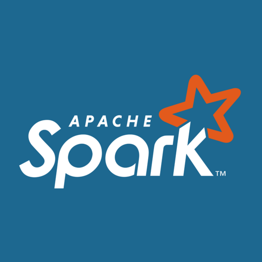

## Hey there! 👋

- I'm **Dewansh**, a junior data engineer passionate about building scalable, cloud-native data pipelines.  
- I specialize in distributed processing, real-time data, and modern data stack tools on Azure & AWS.
  
📝Certification
- Microsoft Azure Data Fundamentals
---

### ⚙️ Tech Stack

- Apache spark
- Airflow
- Databricks
  
  
  

---

📫 How to reach me: [LinkedIn](https://www.linkedin.com/in/dewanshvk/)  

💥💥💥 ~~ [Check out my portfolio here](https://dewanshvk.github.io/)! ~~ 💥💥💥

---

